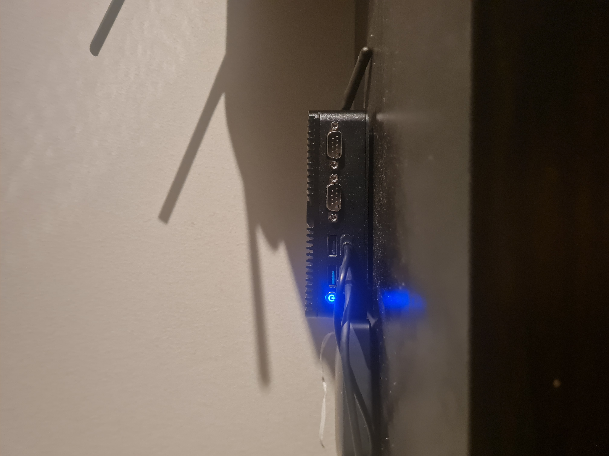

# About Bram Diederik Aka Daft_dutch
- 👋 Hi, I’m @Bram-diederik I'm a software test engineer. That can write long boring test specs and can create sexy test automatons. 
- This page contains all kind of personal development. 
- Dont Expect easy to install programs on my repositories. I am not a professional programmer. Just coding stuff that is beond the creative capabilities of a regular programmer. 

# Blue-mage

My ThinkPad P14s Gen 2a Debian GNU/Linux Laptop. With my own hacked [home assistant widgets](https://community.home-assistant.io/t/kde-widgets/552152). 

# Doorman

My raspberry pi replacement. a celeron 12th gen with 16gig mem. 
running debian. with libvirt and docker containers

it running the following virtual machines

# Karin

My Home assistant server. I use snapcast and raspberry pi's for a multi room speaker environment. Mainly with use with mpd that can be controlled by sascha. I have a voip phones.

# Sascha
My phone assistant asterisk scripts.  If im busy my phone redirects to my landline connected to asterisk and tells the caller im busy. With options to leave a voicemail and certain contacts can call me anyway. 
https://github.com/Bram-diederik/asterisk-homeassistant-tools

# Hushhush

- I did not find a good VPN system that allowes a anonymous vpn connection to the internet but with access to your local network. 
- hushhush is connected to a single vpn server forwarding incoming network over that vpn.
- It comes with rules to make the vpn be used by incomming vpns but i dont use that anymore.
- https://github.com/Bram-diederik/secureVPNwithLocalLan

# ip switcher

With inspiration of the hushhush setup i made code for doorman to select route and dns for ip addesses. 
off course with home assistant integration. 
Block internet to a device. Set your kids devices to limited access when its time for home work. Get VPN on selected clients with out client config. all posiblilities. 

https://github.com/Bram-diederik/ip-rule-switcher
<!---
Bram-diederik/Bram-diederik is a ✨ special ✨ repository because its `README.md` (this file) appears on your GitHub profile.
You can click the Preview link to take a look at your changes.
--->
